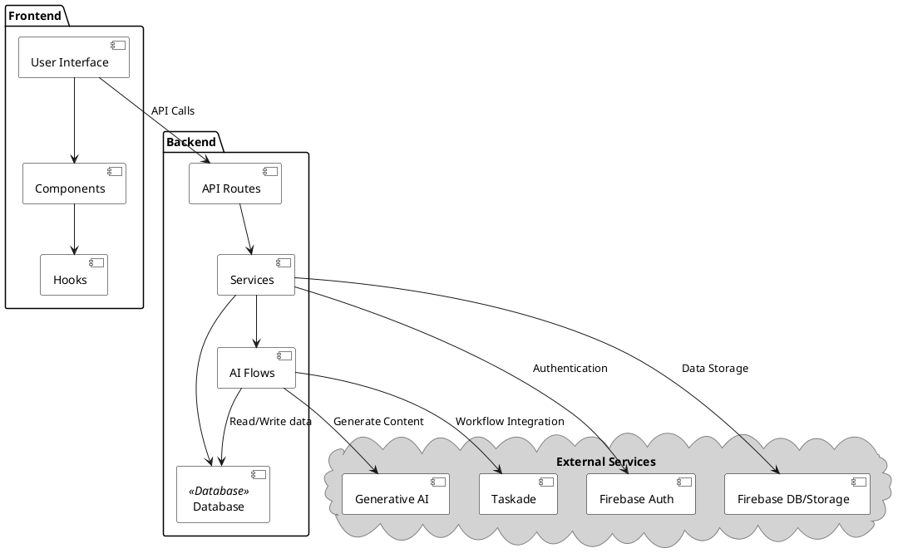

```plantuml
        @startuml
        skinparam component {
            BackgroundColor White
            BorderColor Black
        }
        skinparam database {
            BackgroundColor LightBlue
            BorderColor Blue
        }
        skinparam cloud {
            BackgroundColor LightGray
            BorderColor Gray
        }

        package "Frontend" {
            [User Interface] as UI
            [Components] as Components
            [Hooks] as Hooks
            UI --> Components
            Components --> Hooks
        }

        package "Backend" {
            [API Routes] as API
            [Services] as Services
            [AI Flows] as AIFlows
            [Database] as DB <<Database>>

            API --> Services
            Services --> DB
            Services --> AIFlows
        }

        cloud "External Services" {
            [Generative AI] as GenAI
            [Firebase Auth] as FirebaseAuth
            [Firebase DB/Storage] as Firebase
            [Taskade] as Taskade
        }

        UI --> API : API Calls
        AIFlows --> GenAI : Generate Content
        AIFlows --> DB : Read/Write data
        Services --> FirebaseAuth : Authentication
        Services --> Firebase : Data Storage
        AIFlows --> Taskade : Workflow Integration


        @enduml
```